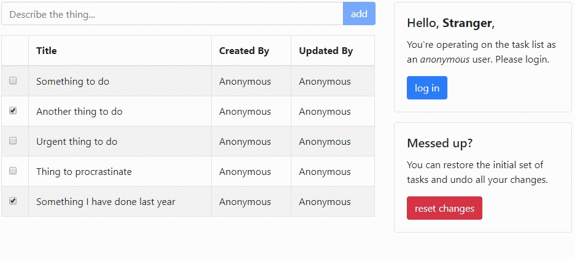
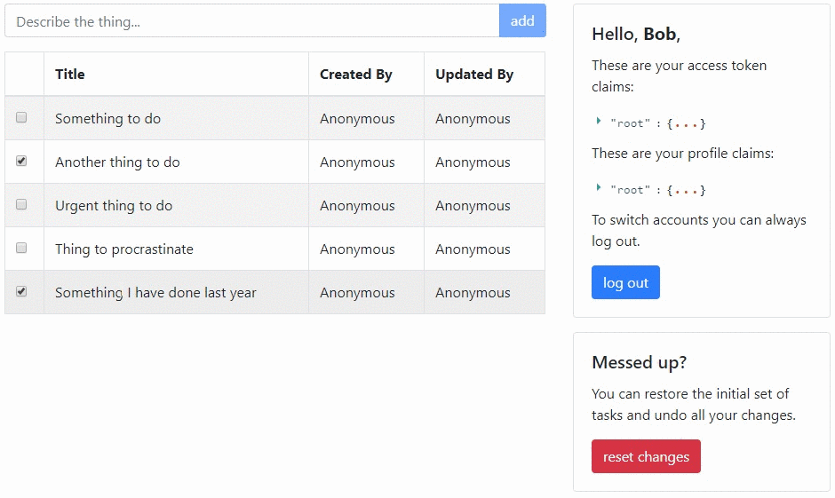

# Szenario & Aufgabe

Eine App zur Task-Verwaltung wurde als PoC implementiert. 

Allerdings sind API und UI noch nicht vor unautorisierten Zugriffen geschützt - das sollt ihr ergänzen. Alle Manipulationen (außer dem Notfall-Reset 😉) an der Taskliste sollen abgesichert werden und der ausführende Benutzer soll in den `CreatedBy`- bzw. `UpdatedBy`-Spalten ausgewiesen werden.

# Was ihr benötigt

Das folgende Setup haben wir verwendet:

* VS2019 Community mit allen Workloads zur Webentwicklung
* .NET Core SDK 3.1.100
* Node.js 12.14.1
* TypeScript 3.5.1

Das heißt nicht, dass es mit anderen IDEs oder Versionen nicht funktioniert. Das solltet ihr allerdings vorher testen.

# Was am Ende herauskommen sollte

Eine mögliche Lösung könnte am Ende so aussehen:

Den Stand findet ihr auf dem Branch `Loesung_Wolf`.

# Wenn ihr nicht weiterkommt

Don't panic! Aber bevor ihr euch verrennt, solltet ihr...

* die Helfer ansprechen
* von der Beispiellösung spicken (Branch `Loesung_Wolf`)

# Hinweise

## IdentityServer4 aufsetzen

Einen IdentityServer4 von Grund auf zu implementieren ist mühsam und zeitfressend, daher bedienen wir uns einem Template. Auf diese Weise schaffen wir euch eine Basis, auf der ihr Zuhause weiter herumprobieren könnt.

* Die Templates werden mit `dotnet new -i identityserver4.templates` installiert
* Mit `dotnet new is4inmem` instanziiert ihr das Template
* Uns interessiert zuerst nur der `Authorization Code`-Flow
* Die Claims zum Scope `profile` sollten umfassen: `name`, `given_name`, `family_name` 

## Anpassungen im Frontend

Es handelt sich um ein React-Frontend, dass den Stand "PoC" sehr gut wiederspiegelt. Das Frontend wird automatisch zusammen mit dem Backend gestartet. Es wird womöglich ein manueller Package Restore erforderlich sein; 
dafür im Ordner `ClientApp` einfach `npm install` ausführen.

* Die UI wurde bereits vorbereitet, sodass ihr euch nicht mit React auskennen müsst. 
* TODO-Kommentare leiten euch zu den dafür vorgesehenen Stellen.
* Die Redirect-Callbacks wurden bereits mit dem `UserService` verdrahtet. 
* Als Library empfehlen wir `oidc-client`.

## Anpassungen im Backend

Das Backend basiert auf aspnetcore 3.1 und stellt ein rudimentäres Backend ohne Persistenz dar.

* Die Authentifizierungsschemata und Autorisierungsrichtlinien sind in der Request-Pipeline zu konfigurieren.
* Die Policies können nach Deklaration über einen Filter oder auch attributbasiert eingefordert werden.
* Als Library empfehlen wir `IdentityServer4.AccessTokenValidation`
* Der `UserResolver` wird Aufrufe an das Discovery-Dokument und den UserInfo-Endpoint machen müssen. Dafür gibt es in oben genannter Library Extension Methods für den `HttpClient`.

# Seid ihr früher fertig?

Cool, damit haben wir nicht gerechnet. Etwas Inspiration für weitere Aufgaben können wir euch trotzdem geben:

* Spielt mit der Tokengültigkeit. Wird euer Frontend einen Silent Refresh/Silent Renew machen?
* Spaßeshalber auch mal die Einforderung des Consent aktivieren
* Die App auch ohne Profile-Consent lauffähig machen
* Das React-Frontend von seinen krakenhaften Auswüchsen befreien durch Flux oder Redux.
